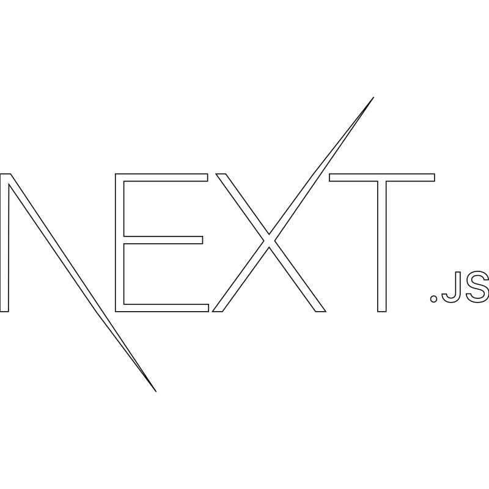
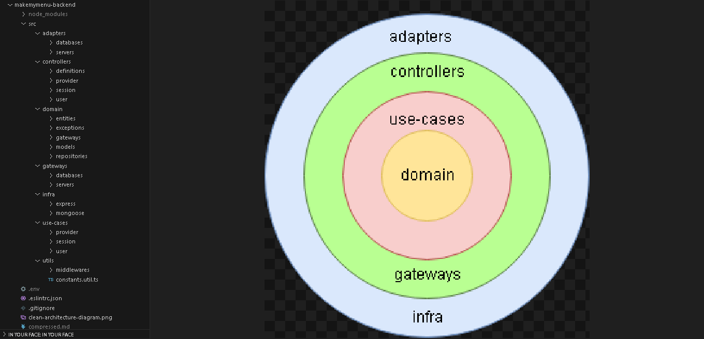

<h1 align='center'> Hola, Bienvenido a mi Presentación! 👋</h1>

## Conocimientos

<h6>Lenguajes de programación</h6>
   

<h6>Frameworks y Librerías</h6>
   

<h6>Web</h6>
   

<h6>Bases de datos y ORMs</h6>
  

<h6>Herramientas</h6>
 

<h6>Editores de texto/ IDEs</h6>
 

## Trabajos realizados / Proyectos

* <h4> Back-end: CRUD & Session's - Clean Architecture & Typescript & express & mongoose </h4>
<!-- gif -->

[MakeMyMenu - Backend](https://github.com/Matias-DR/makemymenu-backend)

* <h4> Front-end: Creación de cuenta manual o con Google y manejo de la sesión - Creación de recetas con IA </h4>
<!-- gif -->

[MakeMyMenu - Frontend](https://github.com/Matias-DR/makemymenu-frontend)

## Portfolio Web
<!-- DEV -->

## Redes

<!-- ESTO VA AL PORTFOLIO -->
<!-- ## Sober mi
Me considero autodidacta, la mayoría de las tecnologías/herramientas de las que conozco las eh aprendido solo, leyendo, viendo videos y escribiendo a prueba y error, además de ir aplicando lo aprendido en mis estudios universitarios (Licenciatura Informática, aún soy estudiante). Me gusta la programación, me gusta el análisis de código, el desarrollo, las aplicaciones de refactor y patrones de diseño.
Como dato personal, también me gusta el deporte y la actividad física en general, desde chico mantengo constancia en esto y es algo a lo que le doy mucha importancia. -->
