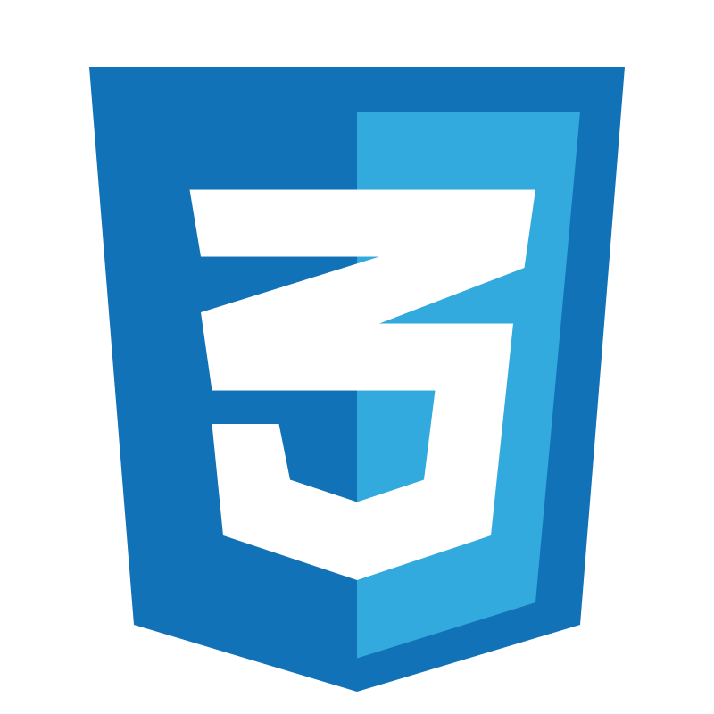

<h2 align='center'> Hola! 👋 Bienvenido a mi presentación.</h2>
<h3 align='center'> Dev Front/Back-end autodidacta.</h3>

<h6>Lenguajes de programación</h6>

<h6>Frameworks y Librerías</h6>

<h6>Web</h6>

<h6>Bases de datos y ORMs</h6>

<h6>Herramientas</h6>

<h6>Editores de texto / IDEs</h6>

